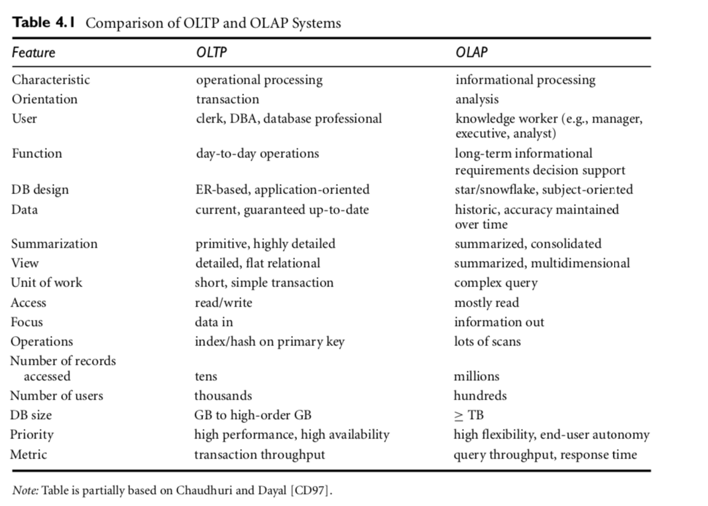
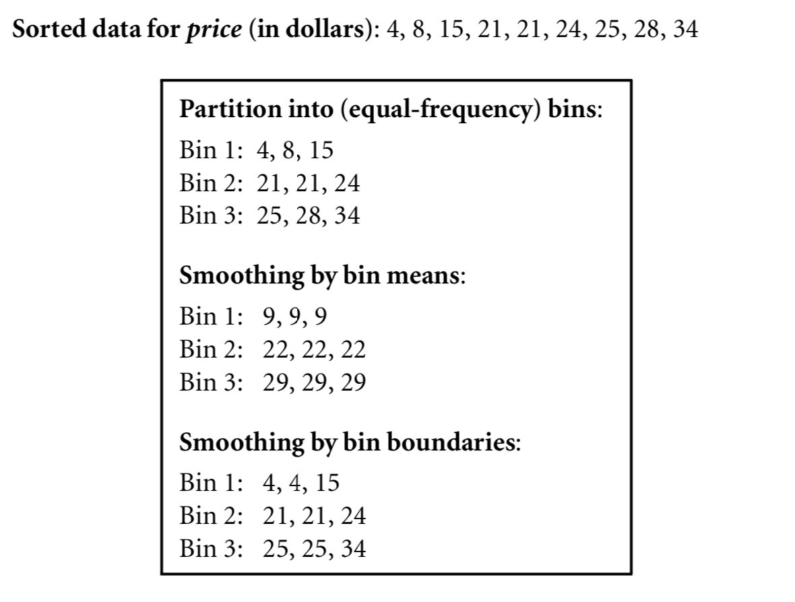
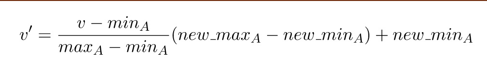
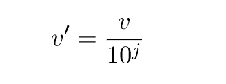

# 1. Introduction to Data Warehousing and Data Mining
## Overview of Introduction 
* Data mining: discovering interesting patterns from large amounts of data
* Natural evolution of db technology
* KDD process involved data cleaning, data integration, data selection, transformation, data mining, pattern evaluation and knowledge presentation
* Data mining functionalities: characterisation, discrimination, association, classification, clustering, outlier and trend analysis
* Data mining systems and architectures
* Major issues in data mining: Different types of data, performance, different DM languages, 
## Data Mining
* Extraction of interesting patterns from huge amounts of data
* Searching for patters of interest
* Also known as:
  * knowledge discovery in databases (KDD)
  * knowledge extracton
  * data analysis
  * information harvesting
## Potentional Application
* Data analysis and decision support
  * Market analysis and management
    * This include specifically targeting customers, market basket analysis and market segmentation etc
  * Risk analysis and management
    * Forecasting, customer retention, improved underwriting, quality control and competitive analysis
* Other Applications
  * Text miining (ie. reddit, email) ~ Web mining for sentiment analysis etc
  * Stream data mining (ie. twitter, live flow of information that's constantly incoming)
# Market Analysis and Management
* Where do we get this data from?
  * Cred card transation
  * Loyality cards
  * Discount coupons
  * Customer complaint calls
  * Lifestyle studies
* Target marketing
  * Finding clusters of "model" 
  * Determine customer purchasing patterns over time
* Cross-market analysis
  * Association/co-relations between product & prediction based on such association
* Customer profiling
  * What types of customer buy what products (clustering or classification)
* Customer requirement analysis
  * Identifying the best products for different cusotmers
  * Predict what factors will attract new customers
* Provision of summary information
  * Multidimensional summary reports
  * Statistical summary infomation
## Knowledge Discovery Process

* Learning the application domain
  * Relevant prior knowledge and goals of application
* Data Selection: Creating a target data set
* Data Cleaning and Preprocessing:
* Data Reduction and transformation
  * Finding useful features, dimenisonality/variable reduction and invarient representatoin
* Choosing functions of data mining
  * Summarization, classification, regression, association and clustering
* Choosing the mining algoirthms
* Pattern evaluation and knowledge presentation
## Data Mining and Business Intelligence

## Architecture - Typical Data Mining System

## Kinds of Data
* Relational Database
* Data Warehouse
* Transactional Database
* Advanced database and information repository
  * Object-relational database
  * Spatial and temporal data
  * Time-series data
  * Stream data
  * Multimedia database
  * Heterogeneous and legacy database
  * Text databases & WWW
## Data Mining Functinalities
* Cocept Description: Characterization and discriminiation
  * Generalize, summarize and contrast characteristics
* Association (correlation and causality)
  * Diaper -> Beer [0.5%, 75%]
* Classification and Prediction
  * Construct models that descripbe and distinguish classes / concepts for future prediction
    * Eg. Classify countries based on climate or classify cars based on gas mileage
  * Presentation: decision-tree, classification rule, neural network
  * Predict some unkown data
* Cluster Analysis
  * Class label is unknown. We group data so we can form new classes
  * Maximize intra-class similarity & minimizing interclass similarity
* Outlier analysis
  * Outlier: a data object that doesn't comply with the general behaviour of the data
  * Might be in the form of noise or excpetion. Not useful for insights
* Trend and evaluation analysis
  * Trend and deviation, ie. regression analysis
  * Sequential pattern mining, periodicity analysis
  * Similarity-based analysis
## Patterns in data
* DM may produce lots of patterns, but not all of them are useful.
* Interstingness Measures
  * A patter that's interesting and easily understood by humans, valid on new or test data with some degress of certainty or some hypothesis that the user is trying to confirm
* Subjective vs Objective Interestingness Measures:
  * Subjective: Basd on the user's belief in the data.
  * Objective: based on statistics and structs of patterns.
* Completeness
  * Finding all the intersting patterns
  * Can a DM system find all the interesting patterns?
  * Heuristic based vs. exhaustive search
  * Association vs Classification vs Clustering
* Optimisation Problem
  * Search for only intersting patterns
  * Can a DM system find only the intesting patterns?
  * Method:
    * Generate all the patterns and then filter out the unintersting ones
    * Mining Query Optimization: Generate only the intersting patterns 
## Classification Schemes
* General Functionality
  * Descriptive data mining
  * Predictive data mining
* Different views, different classifications
  * Kinds of data to be mined
  * Kinds of knowledge to be discovered
  * Kinds of techniques utilized
  * Kinds of applications adapted 
## Multi-Deimension View of Data Minig
* Data to be mined
  * Relational, data warehouse, transactional, stream, object-oriented/relational, active, spatial, time-series, text, multi-media, heterogeneneous. legacy, webpages
* Knowledge to be mined
  * Characterization, discrimination, association, classification, clustering, trend/deviation, outlier analysis
* Techniques Utilised
  * Database-oriented, data warehouse (OLAP), Machine Learning, Statistics, Visualisations
* Applications Adapted
  * Retail, telecommunication, banking, fraud analysis, bio-data mining, stock market analysis, web mining
## Issues in Data Mining
* Mining Methodolody
  * Mining knowledge in different sort of formats: biodata, stream, web etc
  * Performaces: efficiency, effectiveness and scalability
  * Pattern evaluation
  * Incorporation of background knowledge
  * Handling noise and imcomplete data
  * Parallel, distributed and incremental mining methods
  * Knowledge Fusion: Integration fo discoveryed knowledge with existing knowledge
* User Interaction
  * Data mining query languages and ad-hoc mining
  * Expression and visualization of data mining results
  * Interactive mining of knowledge at multiple levels of abstraction
* Applications and social impacts
  * Domain-specific data mining & invisible data mining
  * Protection of data security, integrity and privacy

# 2. Data Warehouse and OLAP
## Overview of Data Warehouse and OLAP
## Data Analysis Problems
* Redundant data found across departments
* Hetergeneous sources
  * Relations DBMS
  * Unstructured data in files (eg. MS Excel) and in documents (MS Word)
* Data is suited for different operating systems 
  * Doesn't integrate well across departments
* Bad data quality
  * Mising data, imprecise data etc
* Data is volatile
  * Data deleted in operating systems
    * Data changes over time - no historical information
## Data Warehouse
* Process of constructing and using data warehouses
* **Data mart** subset of a data warehouse that's usually specific to particular business department. Data warehouses are made up of integrated data marts.
* Is subject-oriented, integrated, time-variant and non-volatile collection of data in support of management's decision making process
### Subject Oriented
* Provide a clear view around the particular subject
  * ie. don't include data that's not relevant in the decision support process
* Organised around major subjects such as customer, product, sales etc
### Integrated
* Integrating multiple heterogeneous data sources 
  * Relational DBs, Flat files etc
* Data cleaning and data integration techniques are applied
  * Ensure consistency in naming conventions, encoding structures, attribute measures, etc. among differnt data sources
  * When data is moved to the warehouse, it's normalised
### Time Variant
* Time horizon for data warehouse is significantly longer than that of operational systems
  * Operational Database: current value data
  * Data warehouse data: provide information from a historical perpective
* Every key structure in the data warehouse
  * Contains an element of time, explicity or implicitly
  * The Key of operational data may or may not contain time element.
### Non-Volatile
* Once data is in the DW it will not change. So historical data in a data warehouse should never be altered.
* A physically separate store of data transformed from the operational environment
* Operational update of data doesn't occus in the data warehouse environment. Does not require transaction processing, recovery, and concurrency control mechnisms
* Requires only two operations in data accessing:
  * Initial loading of data
  * Access of data
## Data Warehouse Architecture
* Extract data from different data sources
  * Clean / Transformation
* Bulk Load / Refresh
  * Warehouse is offline
* OLAP-server provides multidimensional view
* Multidimensional-OLAP
* Relational-OLAP

## Separate Data Warehouse?
* High performance for both systems
  * DBMS: tuned for OLTP: acess methods, indexing, concurrency control, recovery
  * Warehouse: tuned for OLAP: complex OLAP queries, multidimensional view, consolidation
* Different functions and different data:
  * Missing data: decision support requres hostrical data which normal DBs don't maintain (ie. every new time-period a frame is created)
  * Data consolidation: decision support requires consolidation (ie. aggregation and summarisation) from heterogeneous sources
  * Data quality: different sources usually have inconsistent representations, codes and formaats which have to be reconciled.
## OLAP Servers
* Present business users with multidimensional data from data warehouses or data marts, without regarding how the data is stored.
* Different workloads (OLTP vs OLAP)
* Queries hard/infeasible for OLTP, e.g,
  * Which week we haved the largest amount of sales
  * Does the sales of diary products increase over time?
  * Generate a spreadsheet of total sales by state and by year.
* Difficult to represent these queries by using SQL
## OLTP vs. OLAP

## Databases vs Data Warehouses

## The Multidimensional Model
* Datawarehouse is based on a multidimensional data model which views data in the form of a **data cube**, which is a multidimensional generalisation of 2D spreadsheet
* **Data cubes** are modeled using dimensions and facts.
* **Facts**: the subject it models. Facts are numerical measures. 
* **Dimensions**: context of the measures
* **Measures**: numeric function that can be evaluated at each point in the data cube space.
  * Distributive: affregate function that can be computed in a distributed manner as follows. 
* **Hierarchies**: provides contexts of different granularities (aka. grains)
* Goals for dimensional modeling:
  * Surround facts with as much relevant context (dimensions) as possible
### Example
* Subject: analyze total sales and profits
* Fact: Each Sales Transaction
  * Measure: Dollars_Sold, Amount_Sold, Cost
  * Calculated Measure: Profit
* Dimensions:
  * Store
  * Product
  * Time
## Visualizing the Cubes
* 2D view of sales data for a "AllElectronic" according to time and item.
  - 
* 3D view of sales data for a "AllElectronic" according to time, item & location.
  - 
## 3D Cube and Hierarchies
- 
* **Concept Hierarchy**: defines a sequence of mappings from a set of low-level concepts to higher-level, more general concepts. 
  - 
## Cuboids
- 
* **Apex cuboid**  is the 0-D cuboid which holds the highest level of the summation. The apex cuboid is typicallly denoted by *all*. 
* A complete cube of d-dimensions consists of the product of  (L_i+1), from i=1 to d, where L_i is the number of levels (not including ALL) on the i-th dimension.
  * They collectively form the lattice.
  * **Full materialisation** refers to the computation of all the cuboids in the lattice defining a data cube.
    * Requires lots of storage space, especially when the dimensions increase.
    * The **curse of dimenstionality** refers to the excessive storage requirements, each with multiple levels.
  * **Partial materialisation** is where selective computation of a subset of the cuboids in the lattice. Ie. Isceberg cube is a data cube that stores only those cube cells that have an aggregate value (eg. count) about some minimum support theshold.
## Properties of Operations
* All operations are closed under the multidimensional model (i.e. both input and output of an operation is a cube).
* This means that they can be composed.
## OLAP Operations
* **Roll-up** (or drill-up): move up the hierarchy
  * This operation usually aggregates data in the hierarchy hence reducing the dimensionality. 
  * Eg. Hierarchy: street < city < state < country
  * Roll-up operation shoes the aggregates by ascending the location hierarchy from the level of city to the level of country (ie. rather than grouping the data by city, the resulting cube groups the data by country)
* **Drill-down**: move down the hierarchy
  * Reverse of roll-up. Introduces more hierarchies.
* **Slice and dice**: select and project one or more dimensional values
  * Slice performas a selection on one dimension of the given cube resulting in a subcube.
    * 
  * Dice defines a subcube by performing a selection on two or more dimensions.
    * 
* **Pivot (Rotate)**: aggregate on selected dimensions
  * Rotates the data aces in view to provide an alternative data presentation.
    * 
## Logical Models
* Main approaches to represent these cubes using:
  1. Relational DB Technology
    * Start schema, snowflake schema, fact constellation  
  2. Multidimensional Technology
    * Just as multideminsional data cube
### Star Schema
* A fact table in the middle connected to a set of dimension tables
* Each dimension is represented by only one table, and each table contains a set of attributes.
  - 
### Snowflake Schema
* A refinement of star schema where some dimensional hierarchy is normalised into a set of smaller dimension tables, forming a shape similar to snowflake
  - 
### Fact constellation
* Multiple fact tables share dimension tables, viewed as a collection of stars therefore called galaxy schema or fact constellation
  - 
## Query Language
* Two approaches:
  * Using DB tech: SQL (with extensions such as CUBE/PIVOT/UNPIVOT)
  * Using multidimensional technology: MDX
## Indexing OLAP Data: Bitmap Index and Join Index
* Efficient data accessing -> build an index
* **Bitmap indexing**: method used by OLAP servers to allow quick search in data cubes.
  * In the bitmap index for a given attribute, there's a distinct bit vector (Bv) for each value of v in the attribute's domain. 
  * Useful for low-cardinality domains becuse comparison, join and aggregation operations are reduced to bit arithmetic, thus reducing processing time.
  * 
* **Join indexing**: register the joinable rows of two relations from a relational db.
  * Eg. Given the two relations R(RID, A) and S(B, SID) join on the attributes A and B, then join the index record which contains the pair (RID,SID). The join index can identify joinable tuples without performing costly join operations.
  * 
## OLAP Server Architectures
### ROLAP
* Use relational DBMS to store and manage warehouse data and OLAP middleware to support missing pieves. ROLAP servers include optimisation for each DBMS back end, implementation of aggregate navigation logic and additional tools and services.
### MOLAP
* Support multidimensional data views through array-based multidimensisional storage arrays.
* Adopts a two-level storage representation to handle dense and sparse data sets. 
* Advantage: allows fast indexing to precomputed summarized data.
### HOLAP
* Hybring OLAP combines techniques used by ROLAP and MOLAP. 
* Benefits from greater scalability of ROLAP and faster computation from MOLAP.
  * Eg. Large volumes stored in ROLAP and aggregations kept in separate MOLAP store.
## Physical Model + Query Processing Techniques
* Issues
  1. How to store the materialised cuboids?
  2. How to compute the cuboids efficiently?
### ROLAP
#### Top-down Approach
* Involdes computing an cube by traversing down a multi-dimnensional lattice formed from the attributes in an input table.
* Begins by computing the frequent attribute value combinations for the attribute set at the top of the tree.

### Botton-Up Computation (BUC) Approach
* Resource: http://www2.cs.uregina.ca/~dbd/cs831/notes/dcubes/iceberg.html
* The bottom-up computation algorithm (BUC) repeatedly sorts the database as necessary to allow convenient partitioning and counting of the combinations without lots of memory.
* Divide and conquer approach to compute the cube from the bottom up,
* Brief Algorithm:
  1. Counts the frequencies of the first attribute in the input table
  2. Partitions the database based on the frequent values of the first attribute, so tuples with frequent value for the first attribute are further examined
  3. Counts the combinations of values for the first two attributes and partions the database so that tuples that contain frequent combinaton of the first two attributes are further processed.
  4. Repeat for all attributes of the table
* 
### MOLAP
* Sparce array-based multidimensional storage engine
* Pros
  * Small size (good for dense cubes)
  * Fast indexing and query processing
* Cons
  * Scalability
  * Conversion from relation data 
* We use an injective mapping function (no same input maps to the same output) from cell to offset
* Example:
  * 
  1. Create mapping tables
     * 
  2. An injective map from cell to offset
     * f(time,item) = 4time + item
     * 
* Typically the multidimensional array is sparce, after sorting the final values according to the offset
  * Only need to store sorted slots, no need to store the offset.
### HOLAP
* Store all non-base cuboid in MD array
* Assign a value for ALL

# 3. Preprocessing 
## Why Preprocess
* Data can be dirty
  * **Incomplete**: attributes left blank
  * **Noisy**: containing outliers 
  * **Inconsistent**:  conmtaining discrepanies in data format
* Caused by when data is being collected
  * Different data sources
  * Human error
  * Software/hardware issues
* Why is it important?
  * Data mining quality depends on the quality of the dataset.
* Preprocessing is a critical step for data mining and makes up a majority of the work
## Major Tasks
* **Data Cleaning**: Filling in missing values, smoothing noisy data, identify or remove outliers and resolve inconsistencies
* **Data Integration**: Integration og multiple databases, data cubes or files 
* **Data Transformation**: Normalisation and aggregation 
* **Data Reduction**: Obtains reduced represention in volume but produces similar analytical results
* **Data Discretization & Data Type Conversion**
## Data Cleaning
### Missing Data
* Missing data maybe caused by human error, equipment malfunction, misunderstanding.
* Missing data may need to be inferred
  * Lots of algos require all data (ie. no exception handling or whatever)'
  * Tuples with missing values may have true values
* Handling Missing Data:
  * Ignore the whole tuple
  * Manually re-enter all missing data (tedious)
  * Automatically fill with global constant (ie. Unknown)
  * Use the mean of the missing attribute
  * Infer using some method (ie. bayesian formula or decision tree).
### Noisy Data
* Noise is a random error or variance in a measured variable. 
* Incorrect attribute values due to
  * Faulty data collection instruments.
  * Data entry problems.
  * Data transmission problems.
* Handling Noisy Data
  * **Binning Method**
    1. Sort data and partition into equi-depth bins.
    2. Smooth by bin means/median/boundaries etc.
    * 
  * **Clustering**
    * Detect and remove outliers.
  * **Human + Computer Inspection**
    * Detect suspicious values and check by human (e.g. deal with possible outliers).
  * **Regression**
    * Smooth by fitting the data into regression functions.
## Data Integration
* **Data integration**: merges data from multiple data stores
* **Schema integration**: interate metadata from different sources (ie. normalising for schema)
  * **Entity Identification Problem**: Dealing with equivalent real-world entities from multiple data sources (eg. customer_id vs customer_acc from two different data sources that represent the same entity).
* Detecting and resolving data value conflicts:
  * Same real world entity, attribute values from different sources are different
    * Might be due to different representations, different scales (eg. KM vs Miles)
### Handling Redundancy in Data Integration
* Redundant data is data that can be derived from another attribute or set of attributes.
* Can be detected by correctional analysis. 
  * Given two attributes, such analysis can measure how strongly one attribute implies the other, based on the available data.
    * nominal data - use X^2 (chi-square) test
    * numeric data - use covariance 
## Data Transformation
* **Smoothing**: remove noise from data
  * Binning, regression and clustering
* **Aggregation**: summary or aggregation operation applied to the data. 
  * Eg. Daily sales data maybe aggregated to compute monthly and annual totals. 
  * Used when constructing a data cube for analysis
* **Generalisation**: concept hierarchy climbing
* **Normalisation**: scaled to fall withing a small, specified range
  * Essentially converting vectors to unit vectors
  * **Min-max normalisation**: 
    * 
  * **Z-score normalisation**: (or zero-mean normalisaton)
    * 
  * **Normalisation by decimal scaling**: 
    * 
    * Where j is the smallest integer such that max(|v'|) < 1
* **Attribute construction** (or feature construction):
  * when a new attribute is creating from the given ones
* **Discretization**: when a real value is converted to a discrete value (ie. integer)/
  * Raw values can be replaced by interval labels, which can be recursively organised into higher-level concepts
    * Binning is a suitable method for this
* **Concept hierarchy generation for nominal data**: where attributes such as street can be generalized to higher-level concepts such as city or country.
## Data Reduction
* Technique to obtain reduced representation of the data set that's smaller in volume, but produces the same analytical results.
### Dimensionality Reduction
* Reduces the number of random variables or attributes under consideration.
* **The curse of dimensionality**: Adding new dimensions stretches the points across that dimension making them futher apart -> hard to learn
* Goal: reduce dimensions of data, but maintain the meaningfulness of the data 
### Data Compression
* Apply transformations to obtain reduced/compressed representation of data. The data reduction is lossless if the original data can be constructed from the original data, otherwise it's lossy.
### Numerosity Reduction
* Use parametric or non-parametric models to obtain smaller reprsentation of the original data.
* Paramatric Methods
  * Assume the data fits some model, estimate model parameters, store only the parameters and discard the data
  * Log-linear analysis: obtain value at a point in m-D space as the product on appropriate marginal subspaces
* Non-parametric methods
  * Do not assume modesl
  * Major families: histograms (binning), clustering, sampling etc
## Discretization and Concept Hierarchy Generation
* Reduces the number of values for a given continuous attribute by dividing the range of the attribute into intervals. Interval labels can be used to mask the data values. 
* Types of attributes
  * Nominal/Categorical - values from an unorderd set (Jobs: clerk, driver, nurse)
  * Ordinal - values from an orderd set (Grade: A, B, C, D...)
  * Continuous - Real numbers
### Binning
* **Equal-width** (distance) partioning:
  * Divides the range into N intervals of equal size ~ uniform grid
  * if A and B are the lowest and highest values of the attribute, the width of intervals will be W = (B-A)/N 
  * Outliers may dominate presentation
  * Skewed data is not handled well
* **Equal-depth** (frequency) partitioning:
  * Divides the range into N intervals, each containing approximately same number of samples
  * Good data scaling
  * Managing categorical attributes can be ticky
* Optimial Binning Problem
  * Cost(bin) = SSE([x_1,...,x_k]) = sum_{i..m}(x_i - E(x_i))^2
  * Cost of B bins = sum(cost(bin_1),...,cost(bin_b))
  * Problem: find the B-1 bin boundaries such that the cost of the resulting bins is minimized.
  * Solve in O(B*n^2)~time & O(n^2) space
* MaxDiff: Solve the problem in O(nlogn) time and O(n) space (dynamic programming algo)
  * Use the top-(B-1) max gaps in the data as the bin/bucket boundary
### Histogram Analysis
* Partitions the values of an attribute, A, into disjoint ranges called buckets or bins
* Partitioning rules used to define histograms.
### Cluster Analysis
* Plot values and group close values into bins.
* Used to generate a concept hierarchy followed by either a top-down splitting strategy or a bottom-up merging strategy.
### Entropy-based discretization
- Todo
## Data Type Conversion
- Todo

# 4. Classification & Prediction
## Classification vs Regression vs Clustering
* **Classification** (supervised):
  * Predicts categorical class labels (discrete or nomial)
  * Classifies data, by constructing a model, based on training data and class labels
* **Regression** (ie. Prediction - supervised)
  * Models continuous-valued functions, predictos unknown or missing values 
* **Clustering**  (unsupervised)
  * Used to generate class labels by grouping data points
## Supervised vs Unsupervised Learning
* Supervised Learning
  * Supervision: The training data (observations, measurementsm etc) are accompanied by labels indicating the class of the observations.
  * New data is classified based on the training set
  * Includes classification
* Unsupervised learning
  * The class labels of training data is unknown.
  * Given a set of measurements, observations, etc. with the aim of establishing the existence of classes or clusters in the data
  * Includes clustering
## ML Terminology
* A feature instance ~ represented as a N-dim vector x.
  * x = <x1, x2, x3, ..., xN>
* Predicted output / class label presented using N-dim vector y.
  * Binary classification: y = {0, 1}
  * Multi-class classification: y = {1, 2, ...., C}
* Learning
  * Classification: f(x): R^d -> y
  * Regression: f(x): R^d -> R
* Datasets
  * Training Set: used to learn the model, with prelabelled instances data
  * Test Set: Used to validate the model
    * Training error = 1 - (# correctly classified)/(# total instances)
  * Dev Set: Used to tune model's hyperparamters
## Lazy vs Eager Learning
* Lazy Learning
  * Just store training data without learning it
  * Start classifying when it recieves test data
  * Less time training, but more time evaluating
  * Includes kNN, Case-based reasoning
* Eager learning
  * When it recieves training data it starts classifying (ie. learning)
  * More time learning, but less time evaluating
  * Includes decision-tree and bayesian classification
## Instance based learning
* Storing training examples and delay the processing until a new instance must be classified.
### KNN
* Instances are points in euclidian space (n-dimensional).
* Nearest neighbor are defined in terms of euclidean distance.
* Target function could be discrete or real-valued.
* For discrete-valued, the k-NN returns the most common value among the k training examples nearest the input.
* 
## Classification and Regression
## Two Step Process
1. Learning
2. Classification
## Overfitting in Classification

## Decision Tree Classifier
## ID3 Algoritrm
## DT Pruning Methods
## Pessimistic Post-pruning
## Classification in Large Databases

## Bayesian Classification
### Bayes Theorem
### Naive Bayes Classifier
### Smoothing
### Text Classification

## Logistic Regression
### Generative vs Discrimitive Learning
### Linear Regression
### Least Square Fit
### Minimizing a Function
### Least Fit Square for LR
### Probabilistic Interpretation
### Logistic Regression
### Learning W
### Understanding the Equilibrium
### Numeric Solution
### Gradient Ascent
### Newton's Method
### Regularisation
### Generalizing LR to Multiple Classes 

## Support Vector Machine
### Overview of SVM
### Linear Classifiers
### SVM 
### Maximum Margin: Formalization
### Largest Margin
### Geometric Margin
### Help from Inner Product
### Derivation of Geometric Margin
### Linear SVM Mathematically
### Solving the Optimisation Problem
### Geometric Interpretation
### The Optimisation Problem Solution
### Soft Margin Classification
### Classification with SVMsLinear SVMs Summary
### Non-Linear SVMs
### The Kernel Trick
### Why Features Combinations?
### String Kernel
### Classication + SVM + Kernel
### Pros and Cons of the SVM Classifier

# 5. Hidden Markov Model
## Applications
## HMM definition
## Markov Model
## Sequence Probability
## Generative Process
## 3 Problems
## Application - Typed Words
## Csting into Evaluation Problem
## Decoding Problem
## Join Probability
## Viterbi Algorithm

# 6. Clustering
## What is Cluster Analysis
## General Applications of Clustering
## Examples of Clustering Applications
## What is Good Clustering
## Requirements of Clustering in DM
## Cluster Analysis
### Types of Data in CA
### Major Clustering Approaches
## Spectral Clustering
### Overview of Spectral Clustering
### Quadratic Form
### Unnormalised Graph Laplacian
### Binary x induces a Clustering
### Min Cut vs Normalized Cut
### Connection to L
### Relaxation and Optimization 
### Spectural Clustering Algorithm Framework
### Notes on the Algorithm
### Comments on Spectral Clustering

# 7. Association Rules
## Overview of Association Rules
## What's Association Mining?
## Frequent Patterns and Association Rules
## Mining Association Rules
## Association Rule Mining Algorithms
## Apriori Property
## The Apriori Algorithm
## Generating Candidates in SQL
## Derive rules
## Bottleneck of Frequent-pattern Mining
## Notations and Invariants
## FP-tree
## FP Growth vs Apriori
